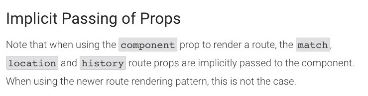
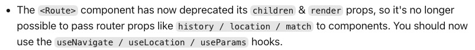

# 따라하며 배우는 노드, 리액트 시리즈

- [x] 기본 강의
- [x] 영화 애플리케이션
- [x] 쇼핑몰 애플리케이션

---

## Troubleshooting

### React Hooks의 useEffect()가 두 번 호출되는 문제

React에서 Express로 작성한 GET 요청에 대한 응답 결과를 받는 테스트를 하는 중이었습니다. <br/>
RandigPage.js 컴포넌트에서 useEffect() Hook을 사용해서 요청에 대한 응답을 console.log()로 호출했는데 두 번 호출이 되었습니다.

검색해보니 해당 문제를 일으킬 수 있는 원인들 중 현재 상황과 비슷한 내용을 찾을 수 있었습니다. <br />
원인은 CRA로 프로젝트를 생성하면 StrictMode가 적용되어 두 번 렌더링되는 문제였습니다.

참고한 [Answer](https://stackoverflow.com/a/60619061)에서 설명하는 세 번째 이슈가 원인이라는 것을 알 수 있었습니다.


다음 코드는 GET 요청에 대한 응답이 두 번 렌더링 되는 코드입니다.

```js
// boiler-plate/client/src/components/views/LandingPage/LandingPage.js
import React, { useEffect } from "react";
import axios from "axios";

function LandingPage() {
  useEffect(() => {
    axios.get("/api/hello").then((res) => {
      console.log(res);
    });
  }, []);

  return <div>LandingPage</div>;
}

export default LandingPage;
```

응답의 결과를 출력하는 console.log() 메서드가 두 번 호출되는 것을 확인할 수 있었습니다.

<br />

[React 공식 문서](https://reactjs.org/docs/strict-mode.html#detecting-unexpected-side-effects)에서도 밝히고 있듯이,

### StrictMode를 활성화하면 예상치 못한 사이드 이펙트를 막는 것을 방지할 수 있습니다. <br />

렌더링 단계의 생명주기 메서드들은 여러 번 호출될 수 있기 때문에, 사이드 이펙트를 포함하지 않는 것이 중요합니다. <br />
이 규칙을 무시할 경우, 메모리 누수 혹은 잘못된 애플리케이션 상태 등 다양한 문제를 일으킬 가능성이 있습니다. <br />
자동으로 사이드 이펙트를 찾아주는 것은 불가능하지만, 조금 더 예측할 수 있게끔 만들어서 문제가 되는 부분을 발견할 수 있게 도와줍니다. <br />
이는 렌더링 단계의 메서드들을 의도적으로 이중으로 호출해서 사이드 이펙트를 찾을 수 있습니다. <br />

StrictMode는 개발모드에서만 적용되고 프로덕션 모드에서만 이중으로 호출되지 않습니다.

create-react-app으로 프로젝트를 생성하면 다음과 같이 StrictMode가 활성화 되어있습니다.

```js
// boiler-plate/client/src/index.js
import React from "react";
import ReactDOM from "react-dom/client";
import "./index.css";
import App from "./App";
import reportWebVitals from "./reportWebVitals";

const root = ReactDOM.createRoot(document.getElementById("root"));
root.render(
  <React.StrictMode>
    <App />
  </React.StrictMode>
);

// If you want to start measuring performance in your app, pass a function
// to log results (for example: reportWebVitals(console.log))
// or send to an analytics endpoint. Learn more: https://bit.ly/CRA-vitals
reportWebVitals();
```

StrictMode를 비활성화하려고 한다면 App을 감싸고 있는 React.StrictMode를 제거 또는 주석처리를 해야합니다. <br />
이 문제는 작성한 코드의 의도와는 다르게 두 번 호출 되어 찾아보고 이해하는 과정에서 시간 소요가 생각보다 길어졌던 문제였습니다.

<br />

### React Router의 Props를 받아오지 못하는 문제

LoginPage 컴포넌트에서 로그인에 성공한 후에 랜딩 페이지로 이동하려고 컴포넌트에서 props를 받아왔으나 아무런 값을 받아오지 못하는 문제가 발생했습니다.
원인은 현재 React Router 버전은 v6, 강의 버전은 v5로 버전업에 따라 props를 받아오는 방식이 달라졌습니다. <br />
찾아보니 [React Router v5: The Complete Guide](https://www.sitepoint.com/react-router-complete-guide/)에서 이유를 찾을 수 있었습니다.



v5의 route props의 전달 방식은 React Router의 Router 컴포넌트를 사용해서 component prop으로 React 컴포넌트를 렌더링할 때,
암묵적으로 router props: match, location, history를 렌더링 될 컴포넌트의 props로 전달합니다.

하지만 [React router V6: Some of the new changes](https://dev.to/sgarciadev/comment/1jpl0)에서 router props를 v6에서 더 이상 전달할 수 없다고 합니다.



이 문제는 useNavigate hook을 사용하면 해결할 수 있습니다.

해결 전 코드

```js
// boiler-plate/client/src/components/views/LoginPage/LoginPage.js
import React, { useState } from "react";
import { useDispatch } from "react-redux";
import { loginUser } from "../../../_actions/user_actions";

function LoginPage(props) {

  const dispatch = useDispatch();

  const [Email, setEmail] = useState("");
  const [Password, setPassword] = useState("");

  const onEmailHandler = (event) => {
    setEmail(event.currentTarget.value);
  };

  const onPasswordHandler = (event) => {
    setPassword(event.currentTarget.value);
  };

  const onSubmitHandler = (event) => {
    event.preventDefault();

    let body = {
      email: Email,
      password: Password,
    };

    dispatch(loginUser(body)).then((response) => {
      if (response.payload.loginSuccess) {
        props.history.push('/') // 변경 전
      } else {
        alert("Error");
      }
    });
  };

  ...

}

export default LoginPage;
```

해결 후 코드

```js
// boiler-plate/client/src/components/views/LoginPage/LoginPage.js
import React, { useState } from "react";
import { useNavigate } from "react-router-dom";
import { useDispatch } from "react-redux";
import { loginUser } from "../../../_actions/user_actions";

function LoginPage() {
  const navigate = useNavigate();

  const dispatch = useDispatch();

  const [Email, setEmail] = useState("");
  const [Password, setPassword] = useState("");

  const onEmailHandler = (event) => {
    setEmail(event.currentTarget.value);
  };

  const onPasswordHandler = (event) => {
    setPassword(event.currentTarget.value);
  };

  const onSubmitHandler = (event) => {
    event.preventDefault();

    let body = {
      email: Email,
      password: Password,
    };

  dispatch(loginUser(body)).then((response) => {
    if (response.payload.loginSuccess) {
      navigate("/"); // 변경 후
    } else {
      alert("Error");
    }
  });
  };

  ...

}

export default LoginPage;
```

v5에서는 Route 컴포넌트에서 React 컴포넌트를 render할 때, implicit으로 props를 전달했었는데 v6에서는 Hook을 사용하여 explicit으로 props 전달하는 것을 인지할 수 있어서 더 나은 방법이라고 생각되었습니다.

<br />

## Troubleshooting - Movie

### antd의 Menu 컴포넌트가 예전 버전과 최근 버전의 문법이 상이해서 에러 발생


문제는 antd의 children으로 Menu.item으로 넘겨주는데 다음 메이저 버전에는 제거되므로 [Composition](https://ko.reactjs.org/docs/composition-vs-inheritance.html)하는 대신 Menu 컴포넌트 prop에 items를 전달해서 에러를 해결해야합니다. 이 문제는 공식 홈페이지에서 해결할 수 있었습니다.


[antd 공식 홈페이지](https://ant.design/components/menu/)에서 밝히고 있듯이, 5.0 버전에서는 4.20.0 이전에 Menu 컴포넌트를 사용했던 방법이 제거될 것이고, 4.20.0 이상부터는 코드를 더 간결하게 작성하고 더 간단한 사용법을 제공하므로 4.20.0 버전 기준으로 버전에 따른 문법 사용을 권장하는 것을 확인할 수 있었습니다.

해결 전 코드

```js
// boiler-plate-movie/client/src/components/views/NavBar/Sections/LeftMenu.js
import React from "react";
import { Menu } from "antd";

function LeftMenu(props) {
  return (
    <Menu mode={props.mode}>
      <Menu.Item key="mail">
        <a href="/">Home</a>
      </Menu.Item>
      <Menu.Item key="favorite">
        <a href="/favorite">Favorite</a>
      </Menu.Item>
    </Menu>
  );
}

export default LeftMenu;
```

```js
// boiler-plate-movie/client/src/components/views/NavBar/Sections/RightMenu.js
import React from "react";
import { Menu } from "antd";
import axios from "axios";
import { USER_SERVER } from "../../../Config";
import { useNavigate, withRouter } from "react-router-dom";
import { useSelector } from "react-redux";

function RightMenu(props) {
  ...

  if (user.userData && !user.userData.isAuth) {
    return (
      <Menu mode={props.mode}>
        <Menu.Item key="mail">
          <a href="/login">Signin</a>
        </Menu.Item>
        <Menu.Item key="app">
          <a href="/register">Signup</a>
        </Menu.Item>
      </Menu>
    );
  } else {
    return (
      <Menu mode={props.mode}>
        <Menu.Item key="logout">
          <a onClick={logoutHandler}>Logout</a>
        </Menu.Item>
      </Menu>
    );
  }
}

export default RightMenu;
```

해결 후 코드

```js
// boiler-plate-movie/client/src/components/views/NavBar/Sections/LeftMenu.js
import React from "react";
import { Menu } from "antd";

const items = [
  { label: <a href="/">Home</a>, key: "mail" },
  { label: <a href="/favorite">Favorite</a>, key: "favorite" },
];

function LeftMenu(props) {
  return <Menu mode={props.mode} items={items} />;
}

export default LeftMenu;
```

```js
// boiler-plate-movie/client/src/components/views/NavBar/Sections/RightMenu.js
import React from "react";
import { Menu } from "antd";
import axios from "axios";
import { USER_SERVER } from "../../../Config";
import { useNavigate, withRouter } from "react-router-dom";
import { useSelector } from "react-redux";

function RightMenu(props) {
  const navigate = useNavigate();
  const user = useSelector((state) => state.user);

  const logoutHandler = () => {
    axios.get(`${USER_SERVER}/logout`).then((response) => {
      if (response.status === 200) {
        navigate("/login");
      } else {
        alert("Log Out Failed");
      }
    });
  };

  const not_auth = [
    { label: <a href="/login">Signin</a>, key: "mail" },
    { label: <a href="/register">Signup</a>, key: "app" },
  ];

  const auth = [
    { label: <a onClick={logoutHandler}>Logout</a>, key: "logout" },
  ];

  if (user.userData && !user.userData.isAuth) {
    return <Menu mode={props.mode} items={not_auth} />;
  } else {
    return <Menu mode={props.mode} items={auth} />;
  }
}

export default RightMenu;
```

버전에 따른 문법의 변경으로 Menu item을 children으로 합성하는 것 대신 prop을 사용하여 코드가 더 간결해졌습니다.

### antd Menu가 Submenu로 변경되는 문제

<br />


앞서 문제인 버전에 따른 문법 에러를 해결했음에도 Menu의 mode를 horizontal로 설정한 2개의 컴포넌트를 같은 라인에 렌더링 했을 경우 Submenu로 변경되는 문제가 있었습니다.


flex items의 flex-grow를 모두 같은 값으로 설정하면 container 내부에서 동일한 공간을 할당합니다.

해결 전 코드

```css
/* boiler-plate-movie/client/src/components/views/NavBar/Sections/Navbar.css */
.menu__container .menu_left {
  float: left;
}

.menu__container .menu_rigth {
  float: right;
}
```

해결 후 코드

```css
/* boiler-plate-movie/client/src/components/views/NavBar/Sections/Navbar.css */
.menu__container {
  display: flex;
  margin-top: 10px;
}

.menu__container .menu_left {
  flex-grow: 1;
}

.menu__container .menu_right {
  flex-grow: 1;
}

.menu__container .menu_right .ant-menu-horizontal {
  justify-content: flex-end;
}
```

### 무비 앱에서 Load More 버튼으로 영화 목록을 추가로 가져오는 작업을 하던 중 에러 발생


에러 내용은 "충돌하는 속성이 설정되었을 때, 리렌더를 하는 중 스타일 속성을 바꾼다면 스타일 버그를 일으킬 수 있습니다.
이를 해결 하기 위해서는, 'shorthand'(기존의 문장 소리, 단어 구를 약어 또는 기호로 대체하여 쓰는 방법) 및 'non-shorthand'를 혼합하지 않아야 합니다.
대신에 분리된 값들로 바꾸면 됩니다."

MDN web docs의 [Shorthand properties](https://developer.mozilla.org/en-US/docs/Web/CSS/Shorthand_properties)에서 문제를 해결할 수 있는 방법을 찾을 수 있었습니다.


공식문서의 내용처럼, shorthand properties로 작성하는 방법 대신 longhand properties로 대신하여 시도를 해보았습니다.

다음은 에러가 발생한 코드입니다.

```js
// boiler-plate-movie/client/src/components/views/LandingPage/Sections/MainImage.js
<div
  style={{
    position: "relative",
    width: "100%",
    height: "500px",
    background: `linear-gradient(to bottom, rgba(0,0,0,0) 39%, 
    rgba(0,0,0,0) 41%, rgba(0,0,0,0.65) 100%),
    url('${props.image}')`,
    backgroundSize: "100%, cover",
    backgroundPosition: "center, center",
  }}
>
  ...
</div>
```

이 코드를 다음과 같이 수정하여 에러를 해결할 수 있었습니다.

```js
// boiler-plate-movie/client/src/components/views/LandingPage/Sections/MainImage.js
<div
  style={{
    position: "relative",
    width: "100%",
    height: "500px",
    background: `linear-gradient(to bottom, rgba(0,0,0,0) 39%, 
    rgba(0,0,0,0) 41%, rgba(0,0,0,0.65) 100%)`,
    backgroundImage: `url("${props.image}")`,
    backgroundSize: "100%, cover",
    backgroundPosition: "center, center",
  }}
>
  ...
</div>
```

이 에러는 수정하지 않아도 정상적으로 애플리케이션이 동작하지만 그 점을 간과하여 나중에 발생할 수도 있는 잠재적 위험에 대한 대비를 하는 것이 좋을 것이라고 생각되었습니다.

## Troubleshooting - Shop

### 여행 상품 업로드 탭에서 드랍존에 파일을 올릴 때, multer를 사용해서 서버에 파일을 업로드 중 에러 발생

문제는 폴더가 존재하지 않을 경우 파일을 업로드 했을 때의 문제였습니다.


같은 문제를 [multer create folder if not exist](https://stackoverflow.com/a/59653876)에서 찾을 수 있었고, 해당 답변을 참고하여 문제를 해결할 수 있었습니다.

다음 코드는 폴더명을 콜백함수로 전달하지만 현재 폴더가 존재하지 않아서 에러가 발생합니다.

```js
// boiler-plate-shop/server/routes/product.js
const express = require("express");
const router = express.Router();
const multer = require("multer");

const storage = multer.diskStorage({
  destination: function (req, file, cb) {
    cb(null, "./uploads"); // 폴더가 없을 경우 에러가 발생합니다.
  },
  filename: function (req, file, cb) {
    cb(null, `${Date.now()}_${file.originalname}`);
  },
});

const upload = multer({ storage: storage }).single("file");

router.post("/image", (req, res) => {
  upload(req, res, (err) => {
    if (err) {
      return res.json({ success: false, err });
    }
    return res.json({
      success: true,
      filePath: req.file.path,
      fileName: req.file.filename,
    });
  });
});

module.exports = router;
```

다음과 같이 파일 시스템 fs 모듈을 사용하여 폴더가 존재하지 않았을 경우, 폴더를 자동으로 생성해서 문제를 해결할 수 있습니다.

```js
// boiler-plate-shop/server/routes/product.js
const express = require("express");
const router = express.Router();
const multer = require("multer");
const fs = require("fs");

const storage = multer.diskStorage({
  destination: function (req, file, cb) {
    const path = "./uploads";
    fs.mkdirSync(path, { recursive: true }); // 폴더가 없을 경우 폴더를 생성해줍니다.
    cb(null, path);
  },
  filename: function (req, file, cb) {
    cb(null, `${Date.now()}_${file.originalname}`);
  },
});

const upload = multer({ storage: storage }).single("file");

router.post("/image", (req, res) => {
  upload(req, res, (err) => {
    if (err) {
      return res.json({ success: false, err });
    }
    return res.json({
      success: true,
      filePath: req.file.path,
      fileName: req.file.filename,
    });
  });
});

module.exports = router;
```

이 문제는 폴더가 존재하지 않았을 경우 에러가 발생하는 문제였는데
폴더를 직접 생성할 수도 있지만, 일일이 폴더를 생성하는 작업이 비효율적이기 때문에 반복될 수 있는 이 작업을 자동화하여 생산성을 높이는 것이 좋다고 생각하였습니다.
